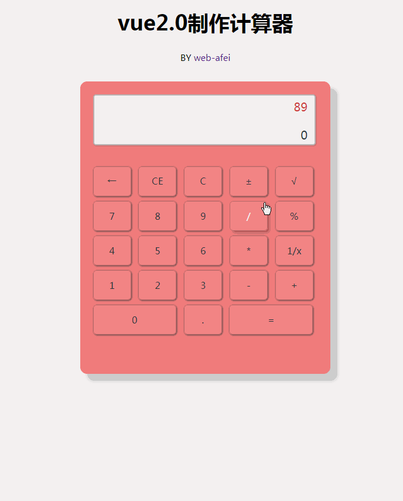

# vue-webpack-calculator

> 用vue.js实现简易计算器<br>
> 基于 vue2.0 + vue-cli +vue-loader.
<br>

# 演示demo

<br>

## Build Setup

``` bash
# install dependencies
npm install

# serve with hot reload at localhost:8080
npm run dev

# build for production with minification
npm run build
```
关于vue-loader更多详细的说明请关注[docs for vue-loader](http://vuejs.github.io/vue-loader).
<br>

## todo item
- add keycode eventListener
<br>

ヾ(o◕∀◕)ﾉヾ 如果有那么一丁点儿喜欢 请随手🌟一下(≧▽≦)/~啦啦啦 <br>
